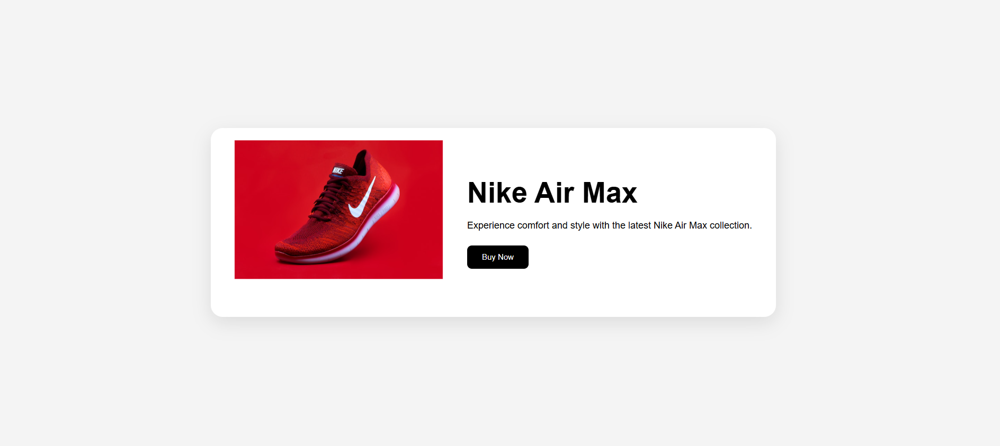

# 👟 Animated Sneaker Showcase

A beginner-friendly **Responsive and Animated Product Showcase** built using **HTML5** and **CSS3**. This project demonstrates the fundamentals of responsive web design and CSS animations through an interactive sneaker product card.

---

## Demo Link - 

---

## 📸 Preview



---

## 🚀 Project Overview

The project features a modern product showcase layout with a floating sneaker animation, hover effects, and a responsive design that adapts seamlessly across desktop, tablet, and mobile devices.

---

## ✨ Features

* Responsive Layout
* Floating Product Animation
* Smooth Fade-In Effect
* Interactive Hover Effects
* Modern Product Card Design
* Mobile-Friendly User Interface
* Clean and Organized Code Structure

---

## 🛠️ Technologies Used

* HTML5
* CSS3
* Flexbox
* CSS Animations
* CSS Transitions
* Media Queries

---

## 📚 Concepts Practiced

### Responsiveness

* Flexbox Layout
* Mobile-First Thinking
* Responsive Design Principles
* Media Queries

### Animation

* CSS Keyframes
* Floating Animation
* Fade-In Animation
* Hover Effects
* CSS Transitions

---

## 📱 Responsive Design

The layout is optimized for:

| Device  | Supported |
| ------- | --------- |
| Desktop | ✅         |
| Tablet  | ✅         |
| Mobile  | ✅         |

---

## 🎯 Learning Outcomes

Through this project, I learned how to:

* Build responsive layouts using Flexbox
* Apply Media Queries for different screen sizes
* Create smooth animations using CSS Keyframes
* Improve user experience with hover interactions
* Structure HTML and CSS in a clean and maintainable way

---

## 📂 Project Structure

```text
Animated-Sneaker-Showcase/
│
├── index.html
├── style.css
└── assets
    └── sneaker-image.jpg
```
---

## 👨‍💻 Author

**Wasim**

Aspiring Full Stack Developer focused on building responsive and user-friendly web applications.

---

## ⭐ Support

If you found this project helpful, consider giving it a star on GitHub.
